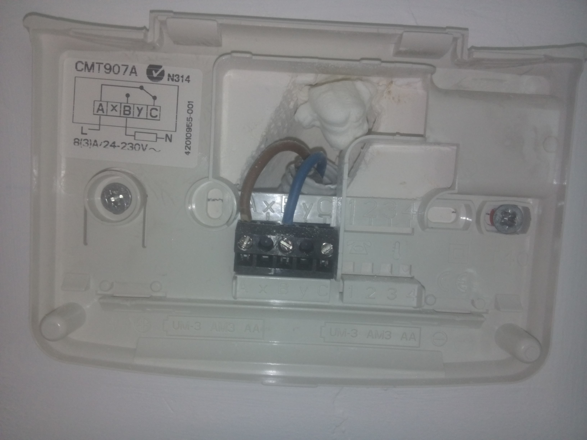

Title:       Nest
Author:      Jan
Date: 	     2014-05-24 23:30
Slug:	     nest
Tags: 	     nest, thermostat, belgium, nest.com, honeywell, ICY, vaillant, TurboTec
Modified:    Mon 9 June 2014

A few years ago I discovered the [nest](http://nest.com) thermostat. It looked nice, is connected to the internet, self learning but a bit expensive and not so much documentation if it will work in Belgium nor with the boiler we have installed (Vaillant TurboTec).

Doing some research on the internet I figured that they have updated their system software and are supporting European countries including Belgium. A solution for the power has also been found by an ICY converter so it could easily be implemented in setups where no power is transferred over those wires.

So I had only to tackle the price, you could order one using the official nest store of the [UK](http://store.nest.com/uk/) but then you would pay about € 300 euro's for only the device. And that was still too pricy for me.

Luckily you can find them for about € 190 on [amazon](http://www.amazon.com/gp/offer-listing/B009GDHYPQ/ref=sr_1_1_olp?ie=UTF8&qid=1401011588&sr=8-1&keywords=nest&condition=new), you have to take into account the shipping and handling fee, € 8 and the import fees € 42. Together with the [ICY converter](http://www.eco-logisch.be/Details.asp?ProductID=3484&category=115) which is about € 50 you have the whole setup for about € 290.

So you could save some money by ordering with amazon!

Convincing myself it's worth the money, and it could save me some on the very long term I took the plunge and ordered one so I could enjoy those geeky features. (Doing so my girlfriend is convinced I'm a nerd, especially because I'm also blogging about it right now)

It only took a couple of days to have those 2 packages delivered and I could start playing around with it.

# Unboxing

The nest comes into an hipster sleek box.


It's almost the same feeling as unboxing the ipod I bought about 10 years ago. Opening the box the first thing which you discover is the nifty looking product itself.


Underneath the nest display a whole bunch of stuff is packed, a paper guide, cool looking screw driver, a couple of mount plates, some screws and the base plate to connect the wires too.


# Initialization

First thing I did was charging the display using a micro USB cable, so I could start configuring it afterwards without being disrupted due to a low battery.


After a night of charging I started configuring the thermostat by first connecting it to our wireless network (using a WPA2 encryption) without any hassle it got connected and started downloading the latest updates


After the updated had been downloaded and got installed the device rebooted itself and was ready for the real work.

# Old thermostat

Before I could get started I had to remove our current thermostat, a Honeywell CM907. I went ahead after I shut down power from our boiler which is connected to the thermostat.


This can be done easily once I figured out how, you have to remove the cover, battery lid and batteries. In the battery compartment I marked two little arrows which indicates being clips you can unlock using a screw driver. Once I got ejected that control panel I got to the wiring underneath.


I wrote down the current wired setup on a sticker and putted it on that plastic base mount. That way I could easily roll back if anything will go wrong in the near or far away future.



# Wiring

## ICY connection

Doing my research on the net I came to the issue of powering your nest device. In Europe most devices are powered by batteries, unfortunately the nest device doesn't. To solve this issue you could use a so called ICY converter. I had to cut the wires coming from my boiler to the thermostat itself.


Next step was to connect the wires from the boiler to the CV clips on the converter and the wires going to the thermostat on the Th clips.


After connecting all the wires I did not yet plugged the converter in. I first installed the mount plate for the base of the nest before powering on all the electrical devices.


## Mountplate

After disassembling my old thermostat I discovered that the wall has some holes and missing paint behind that old mount plate. Luckily you could use the enclosed base cover to hide those imperfections. Once I drilled the holes, screwed the base plate onto the wall I could connect the wires. As you can see on the picture you have to connect on on the W1 port and one on the Rh port.


When I then attached the display, powered on the boiler and plugged in the converter the nest asked configuration of the heating equipment I first got the [E24](http://support.nest.com/#troubleshooting/e24) error which means no power is detected coming to the nest device. I switched the wires from W1 and Rh and repowered the boiler. Now I got the [N23](http://support.nest.com/#troubleshooting/n23) looking at the support pages it's indicating you are using an unusual configuration but my boiler picked up signals coming from the nest thermostat.

# Configuration

I went to all the configuration steps, connecting to the wifi, adding to my online nest account, setting the auto-away options, ... and many more. Once that's done you could see on the screen that I turned the nest to it's minimal, 9° C and that on the moment of taking the picture it was 26° C inside the nest device.


Since I took the decision to install this thermostat in the summer when we don't need the CV system I could not yet fully test the device. I didn't wanted to take the risk not having a working CV when it was cold.


So I had to turn it off for now and will come back with a review of the usage in most likely december when the winter has taken his start over here in Belgium.

# Statistics

Doing some research about applications for the nest thermostat I discovered a tool called [nest-graph](https://github.com/chriseng/nestgraph). This tool collects data from the nest device using the unofficial [nest-api](https://github.com/gboudreau/nest-api) through php.

I forked the nest-graph repository to make some [customizations](https://github.com/visibilityspots/nestgraph.git) like using Celsius instead of Fahrenheit, adding the nest-api-master as a git submodule, changing the database setup and some ignoration of configuration files.

Cause I have the availability of a mysql database on my [one.com](http://one.com) account I decided to collect the data into that database and running the nestgraph service onto that website. Some modifications had to be made to the dbsetup file and adding the login parameters to inc/config.php file.

After successfully running the command

```php
	$ php test.php
```

Once that test is succeeded you could use

```php
	$ php insert.php
```

to fetch the real time data from your nest device and import them into your mysql database.

From my [raspberry-pi](../raspberry-pi.html) I configured a cron job to log in into the my one.com hosting account using ssh and start the import job every 5 minutes.

```cron
	*/5 * * * * ssh ONE.COM-URL "/bin/rm -f /tmp/nest_php_* ; /usr/bin/php /path/to/nestgraph/insert.php > /dev/null"
```
Last but not least I added some security to this service using [htaccess](http://one-docs.com/tools/htaccess/) so all this information isn't publicly available. Now I only have to wait to winter so I can finally start monitoring our heating usage!


# Resources

* [fousa.be](http://www.fousa.be/blog/nest-thermostat)
* [promo-code.be](http://promo-code.be/nest-thermostaat/) (dutch)
* [how-stuff-works](http://home.howstuffworks.com/nest-learning-thermostat.htm)
* [nest-api](https://github.com/gboudreau/nest-api)
* [nest-graph](https://github.com/chriseng/nestgraph)
* [open-source](http://blog.spark.io/2014/01/17/open-source-thermostat/) nest alternative
