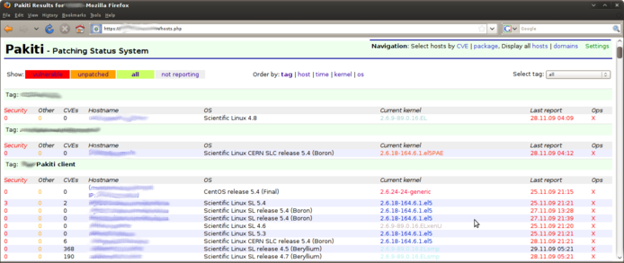

Title:       Pakiti setup
Author:      Jan
Date: 	     2014-04-25 19:00
Slug:	     pakiti
Tags:	     pakiti, monitoring, security, linux, patching, cve

Nowadays it becomes more and more relevant knowing which version of a package is installed and having an overview of the packages infected by some bugs or security holes. That way you could see which servers are possibly vulnerable for those on the dark side.

That's where [pakiti](http://pakiti.sourceforge.net) comes in a clean web based overview of your servers listing all packages vulnerable against the CVE in particular.

It's a client server setup where the client reports the version of the packages to the pakiti server. The server on his turn checks those versions against CVE to see if there are issues.

It is only a reporting tool, so pakiti will never install any package update, that still is and should be a controlled step which prevents unforeseen calls in the middle on the night when auto updates are breaking stuff.

## Pakiti server

On the pakiti website they provide packages you could download and install out of the box. The pakiti-server needs a mysql database to store his data.

The whole installation process is pretty well documented in the documentation section of their homepage

You also need a webserver to deliver the pakiti web service.

A final step is the configuration from where pakiti would fetch the information about which packages are or are not a possible security risk for the server.

## Pakiti client

On the servers you want to monitor the pakiti client package should be installed. Once a day this client will send a list with all packages installed on the system to the pakiti server through HTTP.

The configuration file could be found in /etc/pakiti2/pakiti-client.conf

## Puppet module

Since I believe in automation I also wrote a [puppet-pakiti](https://github.com/visibilityspots/puppet-pakiti) module which can be implemented in an existing puppet tree so you don't have to install and configure all your servers with the pakiti client.

Enjoy the overview, and happy updating ;)
