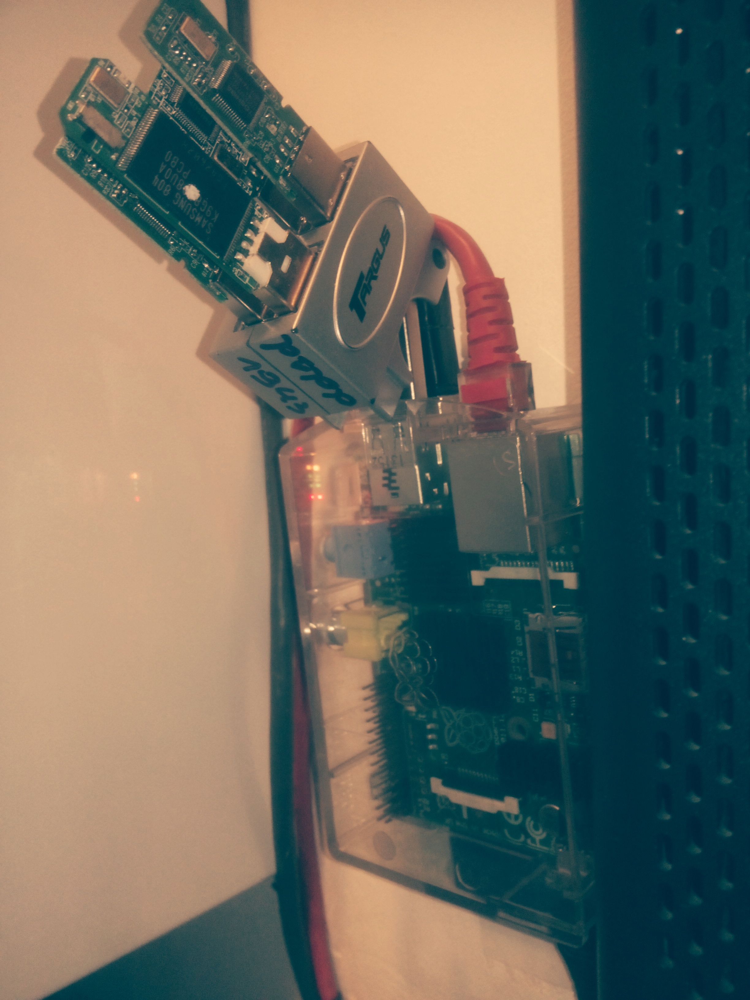

Title:       Raspberry pi setup
Author:      Jan
Date: 	     2014-05-16 19:00
Slug:	     raspberry-pi
Tags: 	     raspberry, pi, archlinux, ARM, software, RAID, mdadm, irssi, bitlbee, usb, disks

Since I discovered the joy of linux servers over desktop distributions a few years ago I revived an old portable and promoted him to be my home server. Connected him to our router in the little storage room on a top shelf gathering dust I could test, configure, break (and pass sleep) a huge variety of open-source software.

Many of those adventures I also used to provide my blog with content. After a while I figured this setup isn't really needed to be powered on 24h a day 7 days a week. So I bought myself a [raspberry pi](http://www.raspberrypi.org/) which would cover the basic functionalities I needed to be online as much as possible without the need of a subscription for a VPS or dedicated server in one fancy pansy datacenter.

For the operating system I didn't choose for the default [raspbian](http://www.raspbian.org), mainly because I don't need a graphical interface. So I headed over to archlinux arm, also called [alarm](http://archlinuxarm.org/platforms/armv6/raspberry-pi).

The [installation](http://archlinuxarm.org/platforms/armv6/raspberry-pi#qt-platform_tabs-ui-tabs2) is quite straight forward. After that I installed some basics I use like:

* [vim](https://wiki.archlinux.org/index.php/vim)
* [ssh](https://wiki.archlinux.org/index.php/Secure_Shell)
* [screen](https://wiki.archlinux.org/index.php/GNU_Screen)
* [yaourt](https://wiki.archlinux.org/index.php/yaourt)

# Communication

To be online day and night I installed a chat client using [bitlbee and irssi](https://wiki.archlinux.org/index.php/Screen_Irssi_Bitlbee). When I am not connected to this chat terminal and I get some message on one of the connected channels a notification will be sent through my android phone using [irssinotifier](https://irssinotifier.appspot.com/) so I could decide if it's important enough to connect using my phone, [juicessh](https://play.google.com/store/apps/details?id=com.sonelli.juicessh) or spin up my laptop.

Be sure to check out all the nifty [scripts](http://scripts.irssi.org/) which can increase the joy of using the irssi chat client.

# RAID

For one of projects running at [inuits](https://www.inuits.eu) I was asked to set up a software raid using [mdadm](http://en.wikipedia.org/wiki/Mdadm). Through the years I have collected a bunch of USB disks. Combining those two facts I figured I could set up a raid using a little usb hub.

I am aware of the bottle neck this hub creates to the raid setup but since it's not for a production environment and I like to play around I doesn't care about it :)

This whole setup is based on the well documented archlinux wiki [page](https://wiki.archlinux.org/index.php/RAID)

4 sticks of 2 GB were formatted to ext4:

```bash
  # mkfs.ext4 /dev/sdXX -L NAME
```

Next step was to identify the UUID's of those freshly created volumes so I could use those to initialize the actual raid setup.

```bash
  $ sudo blkid
  /dev/sde1: LABEL="three" UUID="39564f64-18ed-4f0b-a2d8-9b2d7c62032a" TYPE="ext4" PARTUUID="91f72d24-01"
  /dev/sdb1: LABEL="four" UUID="9b37dc7f-3f0c-44ba-846b-e9ba9efaa03a" TYPE="ext4" PARTUUID="688434a6-01"
  /dev/sdd1: LABEL="two" UUID="321d1d03-eb87-4129-83c7-ee1ce232d1c1" TYPE="ext4" PARTUUID="9852d7fa-01"
  /dev/sdc1: LABEL="one" UUID="d61e46bd-9a28-427e-9a85-94dc292463ec" TYPE="ext4" PARTUUID="00099342-01"
```

Using the gathered UUID's I then created a raid5 using 3 active sticks and one as hot spare device:

```bash
  $ sudo mdadm --create --verbose --level=5 --metadata=1.2 --chunk=256 --raid-devices=3 /dev/md0 /dev/disk/by-uuid/d61e46bd-9a28-427e-9a85-94dc292463ec /dev/disk/by-uuid/321d1d03-eb87-4129-83c7-ee1ce232d1c1 /dev/disk/by-uuid/39564f64-18ed-4f0b-a2d8-9b2d7c62032a --spare-devices=1 /dev/disk/by-uuid/9b37dc7f-3f0c-44ba-846b-e9ba9efaa03a
  mdadm: layout defaults to left-symmetric
  mdadm: /dev/disk/by-uuid/d61e46bd-9a28-427e-9a85-94dc292463ec appears to contain an ext2fs file system
       size=1982464K  mtime=Thu Jan  1 01:00:00 1970
  mdadm: /dev/disk/by-uuid/321d1d03-eb87-4129-83c7-ee1ce232d1c1 appears to contain an ext2fs file system
       size=2013184K  mtime=Thu Jan  1 01:00:00 1970
  mdadm: /dev/disk/by-uuid/39564f64-18ed-4f0b-a2d8-9b2d7c62032a appears to contain an ext2fs file system
       size=2013184K  mtime=Thu Jan  1 01:00:00 1970
  mdadm: /dev/disk/by-uuid/9b37dc7f-3f0c-44ba-846b-e9ba9efaa03a appears to contain an ext2fs file system
       size=1982464K  mtime=Thu Jan  1 01:00:00 1970
  mdadm: size set to 1981440K
  mdadm: largest drive (/dev/disk/by-uuid/321d1d03-eb87-4129-83c7-ee1ce232d1c1) exceeds size (1981440K) by more than 1%
  Continue creating array? y
  mdadm: array /dev/md0 started.
```

You can see the progress of the creation by:

```bash
  cat /proc/mdstat
  Personalities : [linear] [raid0] [raid1] [raid10] [raid6] [raid5] [raid4] [multipath] [faulty]
  md0 : active raid5 sde1[4] sdb1[3](S) sdd1[1] sdc1[0]
        3962880 blocks super 1.2 level 5, 256k chunk, algorithm 2 [3/2] [UU_]
        [>....................]  recovery =  1.8% (36960/1981440) finish=96.5min speed=335K/sec
  unused devices: <none>
```

Once the creation process has been done you can start by updating the configuration:

```bash
  # mdadm --detail --scan >> /etc/mdadm.conf
  # mdadm --assemble --scan
```

And we finally can create a file system on the raid itself:

```bash
  # mkfs.ext4 -v -L NAME -m 0.5 -b 4096 -E stride=64,stripe-width=192 /dev/md0
```

## Issues

Since the raspberry is powered by the USB slot of my ISP's modem and they quite often restart their device for software updates the pi also rebooted from time to time. During such reboots I figured that the process of mounting the raid volume got stuck.

This because the hardware came up to slowly and the mounting process didn't recognized the usb sticks. So I wrote this script (/usr/bin/start-communication) which does the magic (after many try and error attempts).

```bash
  #!/bin/bash
  #
  # Script which mounts the RAID volume storage before starting an irssi screen session

  # Mount the storage RAID volume
  while ! df | grep NAME; do
     echo "10 sec break..."; sleep 10
     sudo mount /dev/md0 /NAME
  done

  echo "storage mounted"

  # Start irssi in a screen session as user 'X'
  if ! screen -list | grep irssi ; then sudo -u X /usr/bin/screen -dmS irssi irssi; fi

  echo "irssi screen session started"
```

This script is triggered by cron after every reboot.

```cron
  @reboot start-communication > /tmp/startup.log
```

And the output is logged in the file /tmp/startup.log.

# VPN

One of the next steps will be a vpn setup based on this [tutorial](https://raymii.org/s/tutorials/IPSEC_L2TP_vpn_on_a_Raspberry_Pi_with_Arch_Linux.html)

# Wake on lan

Once I got configured the VPN setup I will reconfigure my old laptop as being an [sms-service](https://visibilityspots.com/sms-server.html). Since I don't need this service being up all the time I will configure the wake on lan service on that laptop.

That way I can get him up from remote by logging in at my pi and sending the magical WOL packet to that laptop.


