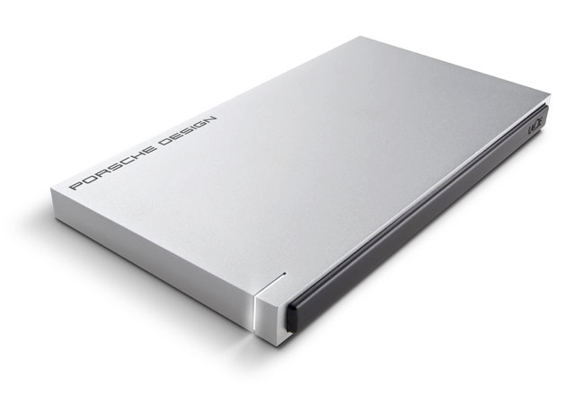

Title:       Rsnapshot backup
Author:      Jan
Date: 	     2014-07-16 19:00
Slug:	     rsnapshot-backup
Tags: 	     udev, usb, disk, archlinux, mount, uuid, serial, cryptsetup, backup, rsnapshot

Some weeks ago I removed some files on my system I wish I didn't cause I still needed them.

Since I use some [encrypted containers in dropbox](https://visibilityspots.com/dropbox.html) I figured I could recover them from this nifty service. But in the logs of dropbox those files are obviously also encrypted. So that was a no go.

Therefore I started looking for backup solutions. The first one I tried was [backintime](http://backintime.le-web.org/), very easy to use, clean GUI interface but failed multiple times in restoring some files.

Looking for a more decent piece of software I found [rsnapshot](http://rsnapshot.org)

And hell I like it. It's not a GUI interface which is a plus for me, it don't use a huge amount of disk space for all the backups, instead it uses symlinks between non changed files and it's completely indepented and automizable by cron.

So I bought myself a [lacie slim P9223 SSD](https://www.lacie.com/products/product.htm?id=10609) external USB 3.0 disk from about 120GB only used for backing up my system.



# Encryption

Since I want my data to be back upped in a secure way I chose to encrypt the entire disk. I will only use it for this backup purpose so it doesn't matter.  To do so I followed a [tutorial](http://blog.abhijeetr.com/2012/06/encrypt-partition-luks-cryptsetup-on.html) I found on the net which describes very clearly every step in the process to achieve an encrypted disk using [cryptsetup](https://code.google.com/p/cryptsetup/).

The data I backup are the decrypted encfs containers from within my dropbox instance. That way dropbox contains my data in an encrypted way so I can synchronize them between multiple machines and I still have a backup on my external hard disk in case of disaster happens.

# UDEV rule

Every time an usb device is connected it is attached to another random /dev/sdX pointer. Since I wrote a little script to mount/umount this encrypted disk I needed a persistent pointer. Using some nifty [udev rule](https://bbs.archlinux.org/viewtopic.php?id=134705) based on the serial of the device this issue is solved by always attaching this disk to the /dev/backup pointer..

Get your devices short serial:

```bash
	$ udevadm info -q all -n /dev/sdX1 | grep SERIAL_SHORT
	E: ID_SERIAL_SHORT=00000000000000000000
```

Write the udev rule itself to attach the device to the /dev/backup pointer:
```bash
	$ sudo vim /etc/udev/rules.d/66-persistent-backup-disk.rules
  	KERNEL=="sd?1", SUBSYSTEMS=="block", ENV{ID_SERIAL_SHORT}=="00000000000000000000", SYMLINK+="backup"
```

That way the device is always attached to /dev/backup and could therefore be used to decrypt and mount:

```bash
	sudo cryptsetup open /dev/backup backup
	sudo mount /dev/mapper/backup /mnt/backup/
```
or umounted and encrypted:

```bash
	sudo umount /mnt/backup
	sudo cryptsetup luksClose backup
```
# Rsnapshot

I read the wiki page of [rsnapshot](https://wiki.archlinux.org/index.php/Rsnapshot) from archlinux and followed their configuration instructions and adapted those to my own preferences. After this configuration has been saved and tested I added some cron magic to automate those backups during my lunch break.

```cron
	# Backup schedule (rsnapshot)
	0 */3 * * * /usr/bin/rsnapshot hourly
	30 12 * * * /usr/bin/rsnapshot daily
	45 12 * * 1 /usr/bin/rsnapshot weekly
	0 13 1 * 1 /usr/bin/rsnapshot monthly

```

So from now on my data is back upped on an encrypted USB hard disk without using any fancy pansy GUI interface :)

Hence feel free to comment if there are some quirks you tackled another way around!
