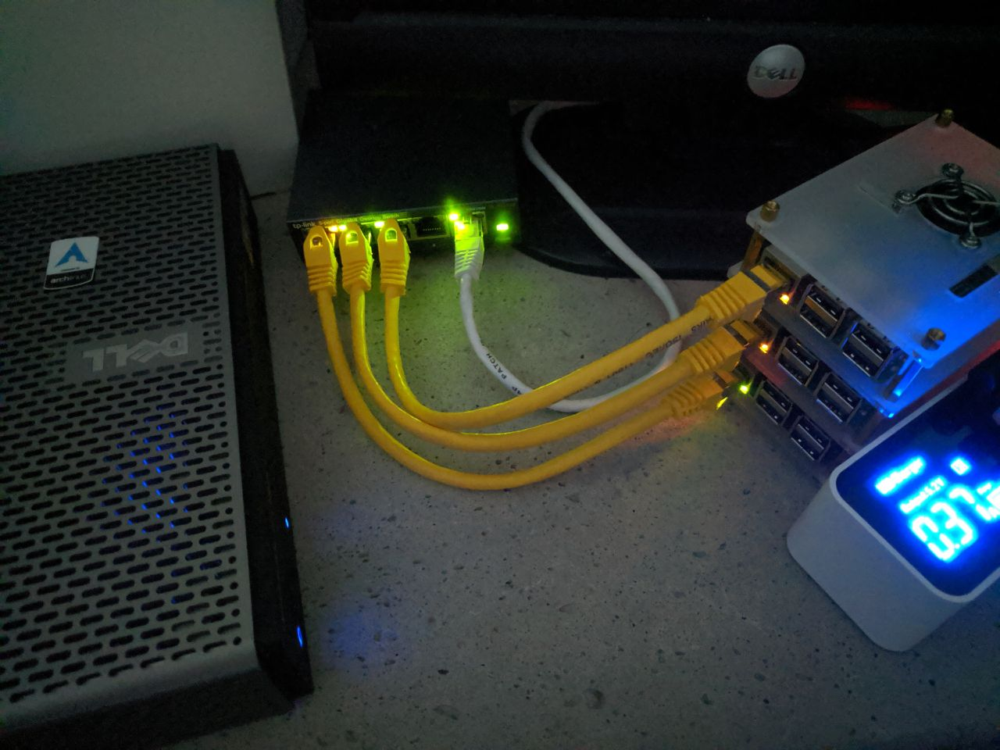
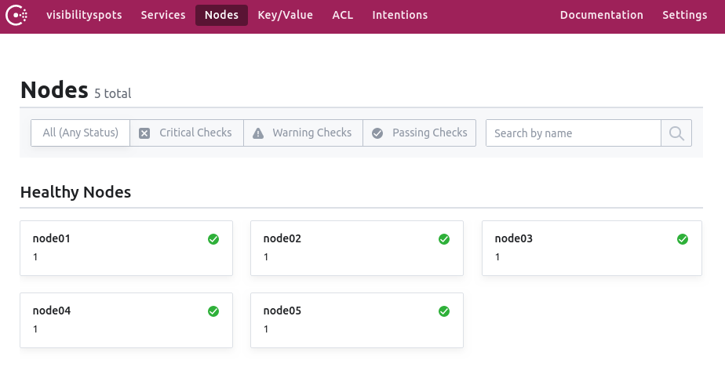
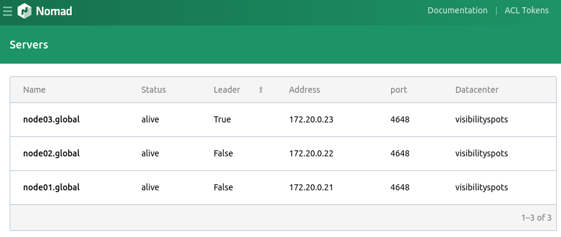

Title:       Nomad ARM cluster
Author:      Jan
Date:        2019-08-28 21:00
Slug:        nomad-arm-cluster
Tags:        nomad, arm, cluster, consul, raspberry, pi, thin, client, thinclient, docker, home, lab, homelab
Status:      published
Modified:    2019-08-28

as I already mentioned a few times before I have some hands on experiences with [nomad](https://nomadproject.io). A couple of weeks ago I wrote about a [local development](https://visibilityspots.org/nomad-local-development.html) setup based on nomad.

Since quite some time I do have a thinclient which is running some docker containers through a docker-compose file I use for personal stuff at home. But this thinclient is suffering from all the containers I'm trying to spin up. While over thinking this issue I did realize I have quite some raspberry pi's laying around and figured I could maybe set up a cluster for those containers.

Since my previous contact with nomad I thought I gave it a try and spin up a nomad home lab cluster.

Priorities first I bought myself a cluster [rack](https://nl.aliexpress.com/item/32754385272.html) tied it together with a small switch and a power supply.



Next I created a custom ArchLinux ARM image based on the [work](https://disconnected.systems/blog/raspberry-pi-archlinuxarm-setup/) of [disconnected systems](https://disconnected.systems/) which I very appreciated since it saved me quite some time!

Once the image was created I pushed the SD cards in the pi's and booted them all.

I did decide to use consul to automate the clustering part as described in the nomad [operations guides](https://www.nomadproject.io/guides/operations/cluster/automatic.html). That way new nomad clients and servers are automatically recognized and added to the cluster when registered in consul.

The side effect of this is a chicken and egg issue, while it would have been cool to run consul as a docker container in the nomad cluster it couldn't be used to auto join the cluster since consul needs to be running before nomad. That's the reason I opted to run consul as a system service instead.

# docker

Since we will use the docker ecosystem to run our containers using nomad the docker daemon needs to be installed configured and ran on the system as explained on the [archwiki](https://wiki.archlinux.org/index.php/Docker)

# consul

[Consul](https://consul.io) is a service networking solution to connect and secure services across any runtime platform and public or private cloud.

## installation
first things first, installing consul using pacman

```bash
$ sudo pacman -S consul
```

## configuration

after that some configuration is required for all the consul nodes by creating a data directory and give the ownership to the consul user

```bash
$ sudo mkdir /opt/consul
$ sudo chown -R consul: /opt/consul
```

next step on the list is the actual configuration of the consul service for a server functionality

**/etc/consul.d/config.json**
```
{
    "acl_default_policy": "allow",
    "addresses": {
        "dns": "0.0.0.0",
        "grpc": "0.0.0.0",
        "http": "0.0.0.0",
        "https": "0.0.0.0"
    },
    "advertise_addr": "IP.ADDRESS.OF.THIS.NODE",
    "advertise_addr_wan": "IP.ADDRESS.OF.THIS.NODE",

    "bind_addr": "0.0.0.0",

    "bootstrap": true,
    "bootstrap_expect": "3",

    "client_addr": "0.0.0.0",

    "data_dir": "/opt/consul",
    "datacenter": "NAME_DC",
    "disable_update_check": false,
    "domain": "consul",

    "enable_script_checks": false,
    "enable_syslog": true,
    "encrypt": "ENCRYPTION_KEY",
    "log_level": "INFO",
    "node_name": "NODE NAME",

    "performance": {
        "leave_drain_time": "5s",
        "raft_multiplier": 1,
        "rpc_hold_timeout": "7s"
    },

    "ports": {
        "dns": 8600,
        "http": 8500,
        "server": 8300
    },

    "raft_protocol": 3,
    "retry_interval": "30s",
    "retry_interval_wan": "30s",
    "retry_join": [
        "CONSUL_SERVER_IPS",
        "CONSUL_SERVER_IPS",
        "CONSUL_SERVER_IPS"
    ],

    "retry_max": 0,
    "retry_max_wan": 0,
    "server": true,
    "syslog_facility": "local0",
    "ui": true
}

```

This configuration is based on a 3 server node setup, when adding extra clients without the server role you can reuse this config but remove the line of **bootstrap_expect** and change **server** to false when configuring a consul client only node.

Most of the parameters to configure should be self explaining if not you can always check the [consul documentation](https://www.consul.io/docs/agent/options.html) for more detailed explanations.

! The encryption key needs to be generated as explained in the [agent encryption](https://www.consul.io/docs/agent/encryption.html) section.

## service

```
# systemctl start consul.service
# systemctl enable consul.service
```

## gui

If everything went well you should be able to access the consul web interface on port 8500 at one of the configured ip addresses.



# nomad

Finally the last and coolest part in the whole setup, [nomad](https://www.nomadproject.io/); the actual cluster orchestrater piece of software.

## configuration

There are 3 configuration parts;

- base
- server
- client

All of them based in /etc/nomad.d/

I began with a 3 server/client node setup but added extra client only nodes afterwards.

**/etc/nomad.d/base.hcl**
```
name = "NODENAME"
region = "global"
datacenter = "DATACENTERNAME"

advertise {
    http = "IP.ADDRESS"
    rpc = "IP.ADDRESS"
    serf = "IP.ADDRESS"
}

consul {
    # The address to the Consul agent.
    address = "localhost:8500"
    # The service name to register the server and client with Consul.
    server_service_name = "nomad-servers"
    client_service_name = "nomad-clients"

    # Enables automatically registering the services.
    auto_advertise = true

    # Enabling the server and client to bootstrap using Consul.
    server_auto_join = true
    client_auto_join = true
}

data_dir = "/opt/nomad"

log_level = "INFO"
enable_syslog = true
```

**/etc/nomad.d/server.hcl**
```
server {
    enabled = true
    raft_protocol = 3
    bootstrap_expect = 3

}
```

**/etc/nomad.d/client.hcl**

```
client {
  enabled = true
  meta {
  }
}

plugin "docker" {
  config {
    allow_caps = [ "ALL" ]
  }
}
```

## service

a systemd unit file is written which will combine all the previous configuration files to start the nomad services;

**/usr/lib/systemd/system/nomad.service**
```
[Unit]
Description=nomad agent
Wants=basic.target
After=basic.target network.target consul.service

[Service]
User=root
Group=bin
ExecStart=/usr/local/bin/nomad agent -config=/etc/nomad.d

ExecReload=/bin/kill -HUP $MAINPID
KillMode=process
Restart=on-failure
RestartSec=42s

[Install]
WantedBy=multi-user.target
```

now start and enable the nomad service so we can access the gui to see if everything works as expected.

```
# systemctl start nomad.service
# systemctl enable nomad.service
```

## gui



# future

Since I'm migrating my current stacks I will add new post for each of those services I tackled afterwards. Starting with the DNS topic and a [vault](https://www.vaultproject.io/) integration.

Also for the different services and how I achieved to run them on my containerized cluster I will try to keep you in the loop through my blog.

For now I use an NFS share from my synology station configured on all the nodes using [autofs](https://wiki.archlinux.org/index.php/Autofs) as shared storage. I do hope to get time once to setup a ceph cluster on those nodes too :D

Another topic I would like to tackle are the job files. Right now those are stored in an NFS share but somehow I would like to have something more advanced to run them somehow..
