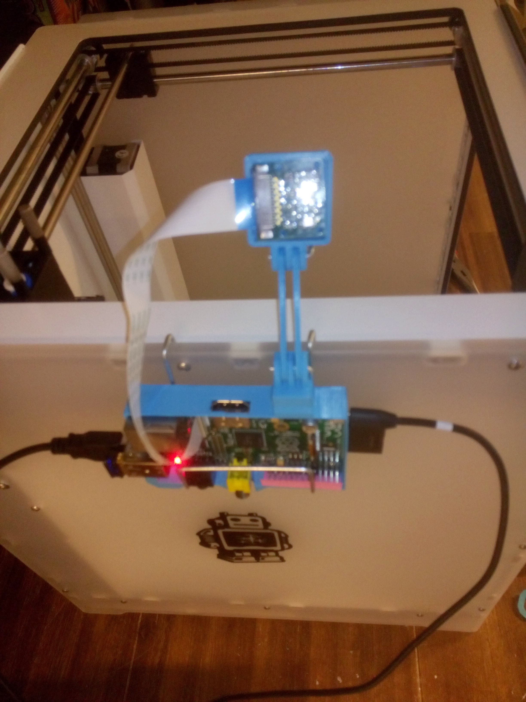
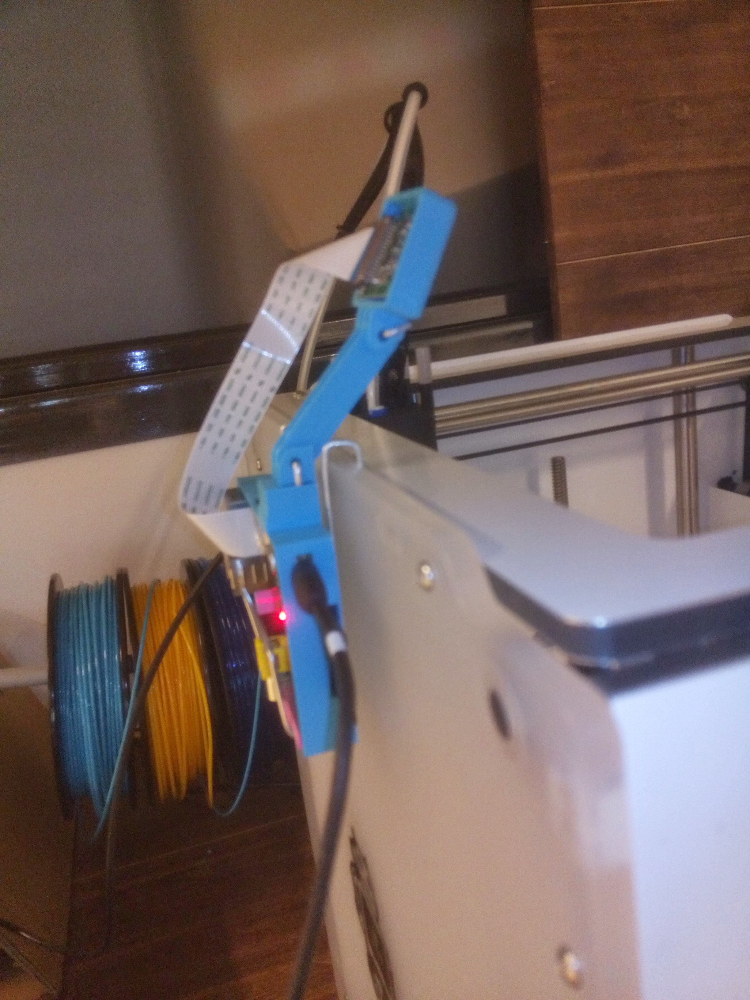
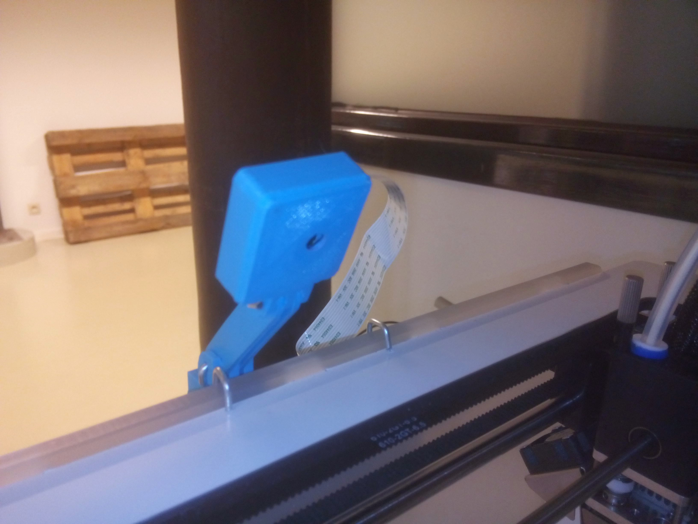

Title:       Octoprint
Author:      Jan
Date: 	     2014-05-02 19:00
Slug:	     octoprint
Tags: 	     raspberry, pi, octoprint, ultimaker, 3d, printing
Status:      published
Modified:    2017-05-10

At our [office](https://inuits.eu) we have an [ultimaker 2](https://www.ultimaker.com/pages/our-printers/ultimaker-2) installed, we have it now for some weeks and already printed out a bunch of stuff. It's cool to see, amazed by the technology.

Expect the manner to start a print job, you have to save your generated [gcode](http://reprap.org/wiki/G-code) files onto an SD card, stick it into the ultimaker and use the rather simple menu from the tiny display to start the print job.

The time of a print job is rather long depending on the object you want to print, so many times you got up and went seeing if everything went alright, so quickly distracted..

This sounds really crazy for such a piece of high tech technology and therefore I did a bit research on the web for a nice remote web interface.

It didn't cost me a lot of time/energy to find out about [octoprint](http://octoprint.org)

# Raspberry

I first started by installing the octoprint manually on a raspbian distribution. But it took really long, I mean REALLY long so I downloaded the preconfigured [image](https://github.com/guysoft/OctoPi), maintained by [Guy Sheffer](http://osrc.dfm.io/guysoft), and installed it on a 4GB SD card.

I did some tweaks on the raspbian distribution, configured a for the pi user, disabled root login for the ssh service, updated the whole distribution and configured the wlan0 interface to connect wireless.

I struggled a bit with the configuration of the wireless part. Merely the pairwise parameter. I forgot to configure it to CCMP for the WPA2 settings of the wireless network. Resulting in the iwconfig output:

```
	unassociated Nickname:"<WIFI@REALTEK>"
```

Once I've setted up the configuration as you can see, network traffic came up on the wlan0 interface:
File: /etc/network/interfaces

```
	allow-hotplug wlan0
	auto wlan0
	iface wlan0 inet dhcp
        	wpa-conf /etc/wpa_supplicant/wpa_supplicant.conf

```

File: /etc/wpa_supplicant/wpa_supplicant.conf
```
	ssid=""
	scan_ssid=0
	psk=""
	proto=RSN
	key_mgmt=WPA-PSK
	pairwise=CCMP
	auth_alg=OPEN
```

# Raspberry cam

We also bought a camera [module](http://www.raspberrypi.org/help/camera-module-setup/) which is discovered automatically by octoprint.

Once you've connected the hardware as described in the [movie](https://www.youtube.com/watch?v=GImeVqHQzsE) and booted the raspberry the camera is immediately picked up by the octoprint service. So therefore you can't connect to the hardware when testing out [raspistill](http://www.raspberrypi.org/documentation/usage/camera/raspicam/raspistill.md) and others to test the cam.

It took me some time to figure that out ;)

You should be able to catch the output of the mjpeg-streamer on port [8080](http://localhost:8080) of the raspberry.

# Octoprint

The octoprint interface is served on port [80](http://localhost). The account details are:

Where you can see the operational state of the printer if everything went well. The connection settings are:

* Serial Port: /dev/ttyACM0
* Baudrate:    250000

Normally the raspberry should connect using those settings automatically at startup to the ultimaker as you could configure in the settings page of octoprint.

# Usage

You can look on for example [thingiverse](http://software.ultimaker.com/) for source files of objects you want to print. (the .stl files). Which you have to slice using [cura](http://software.ultimaker.com/).

Be aware you set the machine settings of the cura to reprap (File -> Machine Settings -> GCodeFlavor -> RepRap (Marlin/Sprinter) ) so the octoprint engine can process your saved gcode files.

Once you've saved your gcode file you need to upload it using the octoprint webpage. After the upload is complete you can search your project in the Files section and click on the little printer icon on the right of the name.

You should see the temperature of the head is increasing to 220 degrees followed by the bed temperature of 70 degrees. Once the ultimaker is warmed up your print will start.

And you should see the progress of it in the octoprint interface.

# Pictures





Happy printing!
