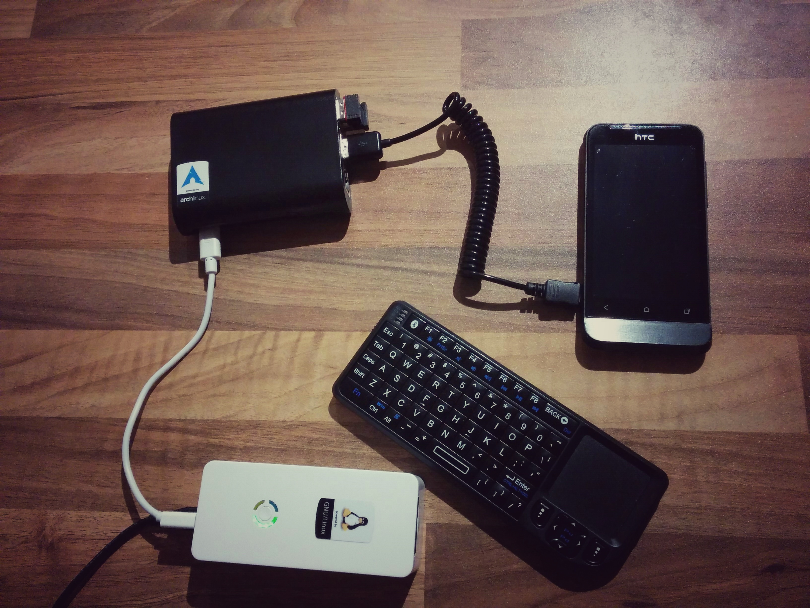
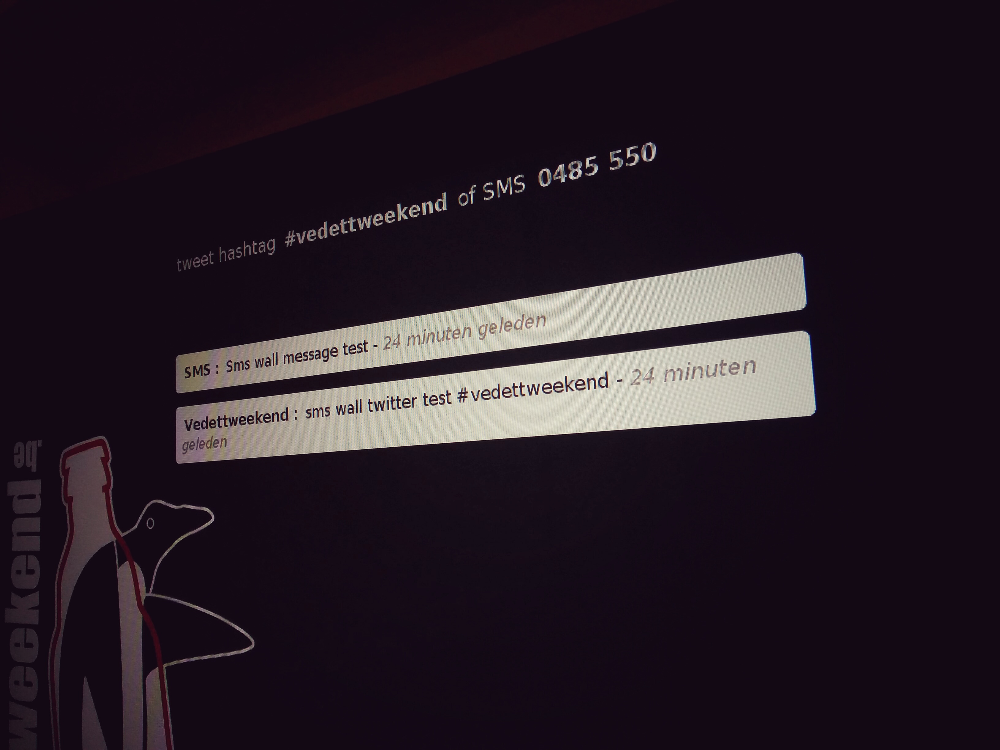
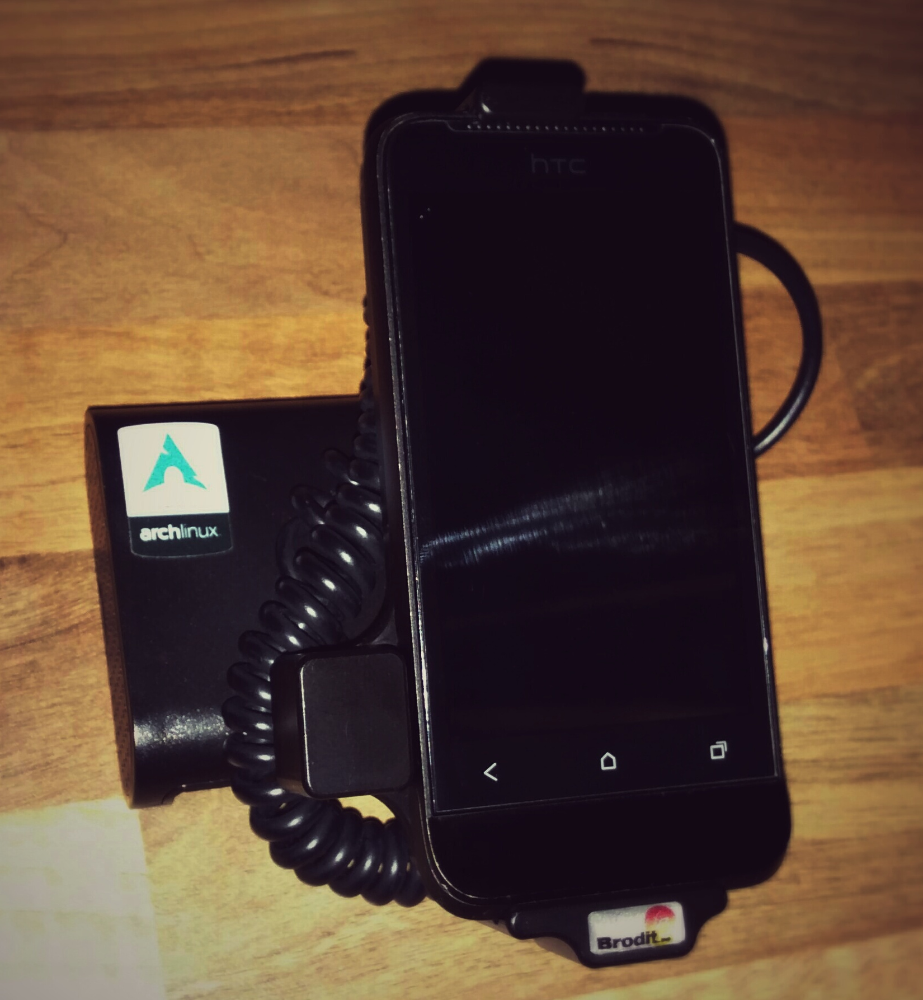

Title:       SMS twitter wall
Author:      Jan
Date: 	     2015-11-03 23:00
Slug:	     social-media-wall
Tags:	     sms,wall,sms-wall,sms-wall.org,tasker,python,php,archlinux,arch,arm,alarm,raspberry,tweet,social,pagekite
Status:	     published

Updated:     2016-10-17 22:00

A long time ago I was active in the local scouting group. To earn some money to keep our group in a healthy financial position we organized a so called vedettweekend. It's an event where people can have a beer, [vedett](http://vedett.be) obviously spin a dance, enjoy a spaghetti and have a good chat with your friends.

I always played with the idea of creating a social media wall on one of the projectors we rented for the event. But I never found/made time for it, until today.. My youngest brother is who's interests are overlapping with mine brought up the idea again. Since he's already managing the [drupal](https://drupal.org) in combination with the facebook page of the organization he was thinking of combining that knowledge to set up a social media page and serve it to one of the projectors using a raspberry pi.

So I picked up back the idea and started looking around on the internet to a neat open-source solution which could help us achieve our goal. I found a solution by [sms-wall](http://sms-wall.org) an open-source piece of software which shows tweets and sms messages in real time.

A disadvantage of this software is the language although the documentation is very detailed it's hard to translate it from time to time from french to english/dutch. Same does count for the text displayed through the web application, I created a [pull request](https://github.com/assobug/smswall/pull/2) to enhance more languages for the front end of the application so this application could reach more people around the globe!

But honestly, this is the only disadvantage, I succeeded setting this up in less then a day and spent more time in setting up the underlying components.

# hardware



* HTC [One V](http://www.htc.com/be-nl/support/htc-one-v/) running [cyanogenmod](http://cyanogenmod.org)
* [Raspberry pi](https://www.raspberrypi.org/products/raspberry-pi-2-model-b/) B+ running [alarm](http://archlinuxarm.org/)
* xtorm XPD06 - [smart hub](http://www.xtorm.eu/en/power-hubs/smart-hub/)
* bluetooth keyboard [RT-MWK02](http://www.amazon.com/Rii-RT-MWK02-Wireless-Keyboard-Pointer/dp/B00BVZZG0C/ref=cm_cr_pr_product_top?ie=UTF8)

In a first reaction I was going to configure the sms-wall on a VPS or laptop and using the pi to show the stream to the public. But when thinking about the whole idea it just triggered my interest if I could configure it all together on a pi and therefore having a mobile setup which can be deployed everywhere.

# software

## operating system

As an archlinux addict off course I will try to get it working on this lightweight distribution. Which seems like the perfect use case for a raspberry pi. Archlinux doesn't come with a lot of services running which you will never gonna need. Every single piece of software you need you have to install and configure yourself. That way only the needed services are occupying resources! Which is exactly what I want in like all my use cases :)

So I started by installing archlinux to the pi as described in the [installation guide](http://archlinuxarm.org/platforms/armv7/broadcom/raspberry-pi-2), once this base setup was running on both the wired as the wireless network I could ssh into the raspberry to start the installation of the different services needed for the operationality of smswall.

It's one of the topics on my todo list to configure a raspberry pi so I could use him as an emergency work station. That means my current window and display manager on a archlinux distribution on a pi. Since this project also needs an output I started to configure this pi with the [slim](https://wiki.archlinux.org/index.php/SLiM) display manager and [ratpoison](https://wiki.archlinux.org/index.php/Ratpoison) window manager.

To get them working you also need [xorg](https://wiki.archlinux.org/index.php/Xorg) and the xf86-video-fbdev driver.

I configured slim to auto login and used .xinitrc in the users home dir to start ratpoison

```
  exec ratpoison
```

That way when booting up the pi my window manager is started up immediately.

## services

Smswall does need a web service and a database, so I installed and configured [apache](https://wiki.archlinux.org/index.php/Apache_HTTP_Server), [mariadb](https://wiki.archlinux.org/index.php/MySQL) and glued them all together through the different configuration options. Don't forget to install and configure the different [extensions](https://wiki.archlinux.org/index.php/Apache_HTTP_Server#Extensions) for apache too, like php and the pdo database drivers.

Once those dependencies are installed I got myself an headache by following the french [documentation](https://github.com/assobug/smswall/tree/master/smswall#smswall) to install the actual service.

I also followed their guidelines to use the python grabber instead of the php tweet grabber and configured an old android phone running cyanogenmod through tasker so it delivers sms messages immediately to the pi itself.


### wireless

To accomplish this behavior I configured the phone as a hotspot and staticly assigned an ip address to the pi. Using this static pi the phone could deliver the incoming messages through the API on served on the static ip on the pi.

Through this hotspot the raspberry also has connectivity to the outside world using mobile data.

During previous events I experienced some malfunction on the wireless adapter, so I decided to introduce bonding which I spent an entire [blog post](../wireless-bond-archlinux.html) about. 

### reverse tunnel

As port forwarding isn't an option on belgian mobile networks I configured a reverse ssh tunnel to an upstream VPS. A systemctl script will run in the background and try when not already up and having an internet connection available to bring up this tunnel.

By doing so I can access the pi from everywhere I have internet connectivity and through some port forwardings I could even access the smswall and admin page myself.

### pagekite

When the pi is also connected to a local LAN through it's ethernet port the reverse tunnel is working fine. But for some events that uplink isn't an option. And for some reason the reverse tunnel option didn't worked out fine. 

So I looked around on the net and stumbled onto [pagekite](https://www.pagekite.org). After setting up a custom frontend on a VPS I could connect the kite running on the raspberry to it. That way I didn't had to subscribe to the free service of pagekite itself and keeping control of the tunnel.

It worked fine through the cli but took me a while to have it started on the pi at boottime. Added it to the startup script;

### startup script
I also wrote a little startup script which waits till there is internet connectivity, start the pagekite service, starts the tweet grabber and the [luakit](https://wiki.archlinux.org/index.php/Luakit) web browser which points directly to the smswall.

```
#!/bin/bash
while ! ping -c1 www.google.com &>/dev/null; do :; done
/bin/bash -c "pagekite &"
cd /srv/http/smswall/
/bin/bash -c "source env/bin/activate; cd stream; python grabber.py &"
xset s off
xset -dpms
luakit http://localhost/smswall/smswall
```

# result

at home I don't have a beamer to test this setup so I attached the pi to our television screen.



And I have to say it really looked nice already on this rather little screen. My first idea was to hook up the pi to a powerbank and hook the powerbank to the electricity as a cheap UPS. Unfortunately all powerbanks I tried weren't able to handle both at the same time.

So I directly connected the pi to the electricity instead. Found also my old carkit for the phone and attached him to the raspberry pi case.



During the event the first evening from about 23 hrs till 4 in the morning about 900 messages were sent through SMS. Tweets where rather rare, about 10 tweets where sent using the hashtag #vedettweekend.

As murphy came through the second day the wifi dongle gave up, since debugging on that big beamer screen wasn't really an option since the event was already started I decided to break up the wall that second evening.

## lessons learned

I need some more robust way of communication between the pi and the raspberry or by bonding 2 wifi dongles or by using the USB tethering instead of wifi.

I spent some money on a tiny tft lcd screen to attach directly to the pi. As soon as it arrives I will try to configure it in a way I could use it for debugging when no hdmi cable is connected to the pi.

It was a real blast and worked perfectly the first night, still we have to warn you, no moderation or filtering has been configured on sms wall. Some people really will abuse this and send some nasty shit to your wall!

On the other hand you do have their phone numbers right now up to you what to do with those ;)

# future

I will try to enhance his setup for the next event, maybe with facebook integration and other social networks. Or with a special mobile number so for every message a part can be used to donate.

I'll update this post with those enhancements and so keep you posted about the progress on this one.
