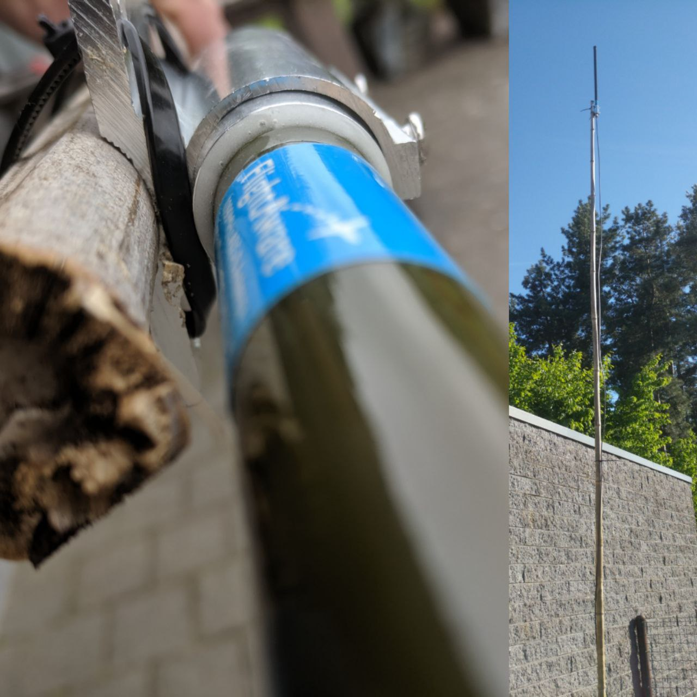
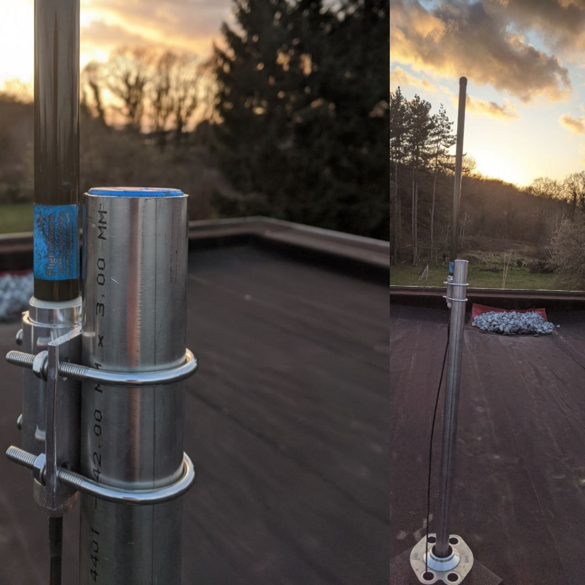

Title:       Piaware on a nomad cluster
Author:      Jan
Date:        2020-01-31 19:00
Slug:        piaware
Tags:        piaware, flightaware, dump1090, ADB-B, nomad, docker, flight, radar, 24, flightradar24, DVB-T, readsb, radarbox, planefinder, adsbexchange
Modified:    2020-01-31
Status:      published

A couple of years ago I stumbled on the [flightaware](https://flightaware.com/) website and figured out you could capture radio signals from an airplane using a DVB-T dongle which can be bought for about EUR 15.

As this really triggered me to start monitoring planes above our head I bought myself such a device, hooked it up to a raspberry pi zero, installed the piaware software and started grabbing the messages and pushing the compiled positions through flightaware.

Through time I managed to upgrade my home lab towards a [nomad cluster](../nomad-arm-cluster.html). So I migrated my piaware setup to a nomad node and wrote a [nomad job file](http://www.visibilityspots.com/documents/piaware/nomad.hcl) to run the docker image.

This was a great achievement in my cluster setup regarding the software. For the hardware I initially used a cheap [DVB-T](https://shop.pimoroni.com/products/dvb-t-dongle-ideal-for-ads-b-real-time-plane-tracking) dongle but I wanted to get more planes and positions so I invested into better gear.

After saving enough by skipping the weekly wok days at work I ordered myself a [1090MHz ADS-B N-Type](https://thepihut.com/products/flightaware-1090mhz-ads-b-antenna-66cm-26in) antenna in combination with the [Flightaware Pro Stick Plus](https://thepihut.com/products/flightaware-pro-stick-plus-usb-sdr-ads-b-receiver). To attach the two together I also got myself a [15m antenna RF coaxial cable](https://www.amazon.com/gp/product/B01FVWCKKE/ref=ppx_yo_dt_b_asin_title_o02_s00?ie=UTF8&psc=1).

As a first test setup I used a large bamboo pole which I hooked up into the garden as you can see;

The pi was placed inside of the garage and connected through the wireless network. Unfortunately I had a bad reception and installed a powerline based AP to have a stronger signal in the garage. But this setup suffered from outages from time to time. Causing the pi to lose connection and therefore many messages got lost :(

Some auto reboots every now and then solved the connectivity issues as a quick 'ducktaped' fix but I wasn't quite happy with it.

The temporary solution of the bamboo stick stood for about a year. Since I didn't wanted (neither was allowed by my girlfriend) to drill a hole through the roof. But I figured out our central heating unit has a fresh air outlet I could use to go to the roof.

So once equipped with a fancy new pole made by my brother I went for it and installed the antenna on the roof and the pi indoors attached with a network cable instead of the wifi;

I then made some time to update the docker container images I used from [Mike Nye](https://github.com/mikenye/docker-piaware) and create some pull requests. Once he merged those I upgraded my nomad job file and running on the latest available stable version of piaware in a container!

The move of the antenna together with a stable connection was a big success seen my stats increased significantly! Still the 'Klitsberg' nearby our home is blocking some signals from that direction unfortunately.. Maybe someday I could set up an antenna on top of that hill who knows.

A few days after I upgraded I figured Mike released a [docker-fr24feed](https://github.com/mikenye/docker-flightradar24) container image which works in tandem with the docker-piaware one. So I went for it adjusted the nomad job file and now I'm not only pushing messages towards [flightaware](https://flightaware.com/adsb/stats/user/visibilityspots#stats-89862) but also towards [flightradar24](https://www.flightradar24.com/account/feed-stats/?id=18592)

Another thing I still need to figure out is the adjustment of the [gain](https://discussions.flightaware.com/t/thoughts-on-optimizing-gain/44482/2) which could me bring even better statistics as today :)

Also since becoming a business member on both platforms because being a feeder could open up a way to an API I could start using to setup my wemos based [plane spotter](https://blog.squix.org/2016/07/esp8266-based-plane-spotter-how-to.html) in the future!
